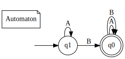
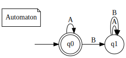

Each subfolder contains:
- `train/`: folder of training data
    - `T_OK.xes`: positive traces
    - `T.xes`: negative traces
- `test/`: folder of training data
    - `T_OK.xes`: positive traces
    - `T.xes`: negative traces

## Eventually

From the root directory, run:

    gradle run --args="./examples/eventually/train ./examples/eventually/test  ./examples/eventually/output"
    
You can check the result in `./examples/eventually/output`.

Inside `./examples/eventually/output`, To print the automaton in SVG format:

    dot -Tsvg dfa.dot -O 

Here's the learned automaton:

## Always

Analogously:

    gradle run --args="./examples/always/train ./examples/always/test  ./examples/always/output"
    cd examples/always/output
    dot -Tsvg dfa.dot -O
    
